# Wiki Agent Kit 优化计划（Skill + Workflow + CLI）

> 日期：2026-08-05  
> 范围：`packages/wiki-agent-kit` 及其生成的 OKF Wiki 产物  
> 目标：把“源码/文档摘要生成器”升级为“面向员工与 LLM 的项目知识编译器”。

## 1. 结论摘要

当前实现已经具备一些正确的工程基础：冻结输入、运行级 workdir、计划 Gate、单 Writer、独立 Review、候选产物 Seal、源码行号校验。但是当前 Gate 主要保证“文件、路径、覆盖单元、引用格式存在”，不能保证 Wiki 真正回答以下问题：

1. 项目解决什么业务问题，服务哪些角色；
2. 核心业务对象、规则、状态和边界是什么；
3. 一个业务请求如何跨 API、应用服务、领域逻辑、数据层和外部系统流转；
4. 文档、源码、配置、测试之间是否存在冲突或缺口；
5. 员工应该按什么顺序阅读，LLM 应该加载哪些页面完成设计和改造任务。

因此，优化重点不应只是继续加 Prompt，而应引入一个稳定的中间知识模型，并让 Skill、Workflow、CLI、Schema、Gate 和模板共同围绕该模型工作：

```text
Sources
  → Normalize / Snapshot
  → Deterministic Code & Document Facts
  → Evidence Graph
  → Project Knowledge Model（业务 + 流程 + 架构 + 数据 + 运行）
  → Wiki Spec（页面问题、章节契约、证据计划、关系计划）
  → Chinese OKF Pages
  → Multi-lens Review
  → OKF Assembly / Diff / Publish
```

推荐分四个阶段实施：

- **P0：修正确性与质量 Gate**：中文、OKF、业务逻辑、流程、模板契约、评测基线。
- **P1：重构发现与规划模型**：Evidence Graph + Project Knowledge Model，解决“只按目录/模块扫描”的根因。
- **P2：增强 CLI 与增量维护**：文档适配器、一键运行、恢复、diff、publish/update。
- **P3：面向 LLM 使用与设计文档生成**：检索包、任务上下文包、设计文档 profile、影响分析。

---

## 2. 当前实现盘点与根因

### 2.1 已有优点，应保留

| 能力 | 当前实现价值 | 后续策略 |
|---|---|---|
| 冻结源码和 Skill | 避免运行中证据漂移 | 保留，扩展为所有文档类型的内容寻址快照 |
| Plan Gate + Digest Receipt | Write 前锁定规划输入 | 保留，把语义 Gate 做深 |
| 单 Writer | 避免并发覆盖 Wiki 页面 | 保留，未来可按互斥目录分片，但默认单 Writer |
| Review Lens 并发 | 支持独立审查 | 保留并增加业务、中文、OKF、员工可用性审查 |
| 行号引用校验 | 能机械验证代码引用存在 | 保留，同时升级为 OKF provenance 模型 |
| Candidate Seal | 产物不可变、可追踪 | 保留，增加发布产物和增量版本清单 |

### 2.2 关键问题

#### 问题 A：覆盖单元是“构建模块”，不是“业务知识单元”

Inventory 当前将 Maven/Gradle module 或 Node package 直接作为 required coverage unit。大型仓库会产生大量粒度不合理的 survey。现有 Spring AI 测试运行中：

- 1 个 source；
- 1,895 个文件；
- 118 个 surface/coverage unit；
- 当前只生成了 4 个 survey receipt，尚未形成 Discovery Map 和 Spec。

这意味着 Workflow 的成本和完成时间近似随构建模块数量线性增长，而且每个 survey 都容易重复阅读根 POM、公共接口和共享模块。更严重的是，“所有模块都被扫到”并不等于“业务流程被理解”。

**根因：** Inventory 同时承担了文件盘点、工作拆分和语义覆盖三个职责，模块边界被错误地当成了知识边界。

#### 问题 B：Discovery Map 与 Spec 的 Schema 太弱

当前 `discovery-map.schema.json` 对 domain 基本只要求 `id`；flow 甚至没有强制 `id`、步骤、触发器、状态变化或证据。`spec.schema.json` 对页面只强制 `path`。因此以下低质量结果仍可能通过结构校验：

- domain 只有名字，没有业务职责、对象或上下游；
- flow 只有一个标题，没有步骤、分支、失败路径；
- page 有路径但没有明确受众、问题、章节、证据计划；
- 所有 coverage unit 都挂到一个 overview 页面，形式上“覆盖”，实际上不可读。

**根因：** Gate 校验的是 ID 绑定，不是知识充分性。

#### 问题 C：Skill 偏“证据纪律”，缺少“业务理解方法”

当前 Skill 强调冻结证据、引用、页面边界和 Review，但没有要求系统化抽取：

- 业务角色与目标；
- 业务能力与 bounded context；
- 核心实体、值对象、生命周期和状态机；
- 业务规则、前置条件、后置条件、不变量；
- 关键用例的 happy path、分支、失败、重试、补偿；
- API → service → domain → persistence → event/integration 的跨层映射；
- 文档与源码冲突、设计意图与实际实现差异。

模板也只是建议性 bullet，没有章节级必填合同。模型容易产出“模块职责 + 类名列表 + 泛化描述”。

#### 问题 D：中文只靠一句 Prompt，没有可验证合同

`wikiLanguage` 已传入 run policy，但：

- Skill、模板和 Workflow 指令主体都是英文；
- 模板标题和 index 生成器固定为英文；
- Validator 不检查中文比例、标题语言、描述语言或混合语言；
- 缺少术语表，模型可能把稳定业务术语翻译不一致；
- `wikiLanguage` 只支持 `zh`/`en`，无法表达 `zh-CN`、中文风格、术语策略。

所以“配置为 zh”并不能形成 fail-closed 的中文输出。

#### 问题 E：当前仅达到 OKF 的最小结构形态，未利用 OKF 的信任和来源能力

本地 OKF v0.2 规范只强制 concept 文档包含 frontmatter 和非空 `type`；`title`、`description`、`sources`、`generated`、`verified`、`status`、`stale_after` 等属于推荐或可选字段。

当前 Validator 强制 `type/title/description` 是合理的产品级超集，但同时禁止模型写入 `generated`、`verified`、`stale_after`，且没有由 host 补写这些字段；页面也没有 OKF `sources` provenance，只使用自定义的相对源码链接。结果是：

- 可以机械通过当前 Validator；
- 但消费者无法从 frontmatter 查询来源、生成者、验证级别和新鲜度；
- 产物离开 run workdir 后，相对 `../sources/...` 链接可能失效；
- index 未使用页面 description，且固定输出 `# Index / Directories / Pages`，不利于中文和渐进式阅读；
- 没有增量 `log.md` 生成策略。

#### 问题 F：没有“持久 Wiki 更新”闭环

当前 README 明确 candidate 是 run-local，且没有 publish action。这适合实验性候选产物，但不满足 LLM Wiki 方法强调的“持续积累、增量更新、冲突处理、已有页面合并”。

缺失能力包括：

- 首次生成与增量更新的区分；
- source → page ownership / contribution 关系；
- 新来源加入后哪些页面需要更新；
- 页面 diff、冲突和废弃处理；
- 从 sealed candidate 晋升到持久 `wiki/`；
- 旧来源删除或修改后的知识回收；
- 页面级 freshness 和 review 状态。

#### 问题 G：仅适配源码目录，不是真正的“文档 + 源码”摄入

当前 source 主要是 clone/path，并使用代码构建文件识别 surface。缺少 PDF、DOCX、PPTX、HTML、Markdown 文档集、图片/OCR、OpenAPI、数据库 schema 等适配器及其统一规范化输出。

---

## 3. 产品目标与产物定义

### 3.1 首要用户场景

#### 场景 1：新员工 30 分钟熟悉项目

Wiki 应回答：

- 项目定位、用户与价值；
- 业务域、核心对象和关键术语；
- 3–10 条最重要的端到端流程；
- 代码/服务/数据/部署结构；
- 已知缺口、风险和文档冲突；
- 推荐阅读顺序和本地运行方式。

#### 场景 2：LLM 快速建立可靠项目上下文

Wiki 应支持 LLM 逐级加载：

1. 根 `index.md` 与 `overview.md`；
2. 任务相关 domain / flow；
3. 参与模块、数据对象、API；
4. 证据和源码位置；
5. 约束、风险、未决问题。

#### 场景 3：基于 Wiki + 源码生成设计文档

设计文档生成不应重新从全仓库开始阅读，而应复用：

- Project Knowledge Model；
- 已验证的业务流程和状态机；
- 模块依赖和调用链；
- 当前问题、约束和证据；
- 变更影响范围。

### 3.2 推荐页面类型

OKF 的 `type` 是开放字符串，不必局限于当前五类。建议定义项目 Wiki profile：

| 类别 | 推荐 type | 目的 |
|---|---|---|
| 导航 | `Overview` | 项目价值、最小心智模型、阅读路径 |
| 业务 | `Business Domain` | 业务边界、能力、角色、上下游 |
| 业务 | `Business Capability` | 一项稳定业务能力及规则 |
| 业务 | `Business Process` | 端到端流程、分支、异常、状态变化 |
| 业务 | `Business Rule` | 可独立引用的不变量、校验、策略 |
| 业务 | `Glossary` | 术语、别名、代码名、业务含义 |
| 架构 | `Architecture` | 系统边界、组件、依赖方向 |
| 代码 | `Module` | 模块职责、公有面、调用者和依赖 |
| 接口 | `API Surface` | API、事件、消息或 CLI 契约 |
| 数据 | `Data Model` | 实体关系、表、所有权、一致性规则 |
| 运行 | `Runtime Guide` | 启动、配置、部署、可观测性、故障处理 |
| 质量 | `Known Gap` | 文档/源码冲突、缺失实现、技术债、风险 |
| 决策 | `Decision` | 已存在的架构或业务决策及证据 |

不是每个项目都必须生成全部类型；Planner 应根据 reader question 和证据决定页面集合。

---

## 4. 目标架构

```mermaid
flowchart LR
    A["Source adapters\nrepo / dir / md / pdf / docx / pptx / openapi / sql"] --> B["Immutable snapshot\ncontent hash + origin + version"]
    B --> C["Deterministic analyzers\nfiles / symbols / calls / APIs / schema / configs"]
    B --> D["Document analyzers\nsections / claims / terminology / decisions"]
    C --> E["Evidence Graph"]
    D --> E
    E --> F["Project Knowledge Model\nbusiness domains / capabilities / flows / states / rules / modules / data"]
    F --> G["Wiki Spec\nreader questions + section contracts + evidence plan + links"]
    G --> H["Chinese page generation"]
    H --> I["Review council\nbusiness / grounding / language / IA / OKF / LLM usability"]
    I --> J["OKF assembler\nprovenance + indexes + log + manifest"]
    J --> K["sealed candidate"]
    K --> L["publish / update persistent wiki"]
    F --> M["design-doc profile"]
```



### 4.1 三层中间模型

#### 层 1：Evidence Record

每条证据应至少包含：

```json
{
  "id": "evidence:repo:path:symbol-or-span",
  "sourceId": "app",
  "kind": "code|doc|config|test|api|schema|commit",
  "path": "src/.../OrderService.java",
  "span": { "startLine": 10, "endLine": 42 },
  "symbol": "OrderService.submit",
  "claim": "提交前订单必须处于 DRAFT 状态",
  "language": "java",
  "contentDigest": "...",
  "confidence": "direct|inferred",
  "authority": "runtime|test|design-doc|readme|generated-doc"
}
```

#### 层 2：Project Knowledge Model（PKM）

建议新增 `analysis/project-model.json`，至少包括：

- `productPurpose`、`actors`、`externalSystems`；
- `domains[]`、`capabilities[]`；
- `entities[]`、`states[]`、`rules[]`；
- `flows[]`：trigger、preconditions、steps、branches、failures、stateChanges、sideEffects；
- `modules[]`、`apis[]`、`dataModels[]`；
- `mappings[]`：业务概念到代码/数据的映射；
- `conflicts[]`、`gaps[]`、`openQuestions[]`；
- 每个对象的 `evidenceIds[]`。

#### 层 3：Wiki Spec

Spec 不再只列 path；每个 page 应声明：

```json
{
  "path": "flows/order-submit.md",
  "type": "Business Process",
  "title": "订单提交流程",
  "audiences": ["new-engineer", "llm"],
  "question": "订单从草稿提交后如何校验、流转和失败？",
  "requiredSections": [
    "业务目标",
    "参与角色与边界",
    "前置条件",
    "主流程",
    "分支与失败路径",
    "状态变化与副作用",
    "代码与数据映射",
    "已知缺口"
  ],
  "knowledgeIds": ["flow:order-submit", "rule:order-draft-only"],
  "evidenceIds": ["evidence:..."],
  "relatedPagePaths": ["domains/orders.md", "data/order-model.md"],
  "critical": true
}
```

---

## 5. Skill 优化计划

### 5.1 将 Skill 从“写作说明”升级为“知识编译方法”

建议拆成以下 references：

```text
references/
  source-normalization.md
  evidence-model.md
  business-discovery.md
  code-discovery.md
  conflict-resolution.md
  project-model.md
  wiki-planning.md
  chinese-writing.md
  okf-profile.md
  generation.md
  review.md
  incremental-update.md
  design-doc-generation.md
```

### 5.2 Discover 阶段必须执行的分析顺序

1. **项目身份校验**：README/项目名/运行配置/数据库名/入口是否一致；
2. **业务语言抽取**：角色、业务对象、动作、状态词、错误码、事件名；
3. **入口识别**：HTTP、RPC、消息、定时任务、CLI、UI route；
4. **流程追踪**：从入口追到应用服务、规则、数据写入和外部副作用；
5. **状态与规则抽取**：enum、状态字符串、条件分支、校验异常、事务边界；
6. **数据模型分析**：表/实体/DTO/事件之间关系与权威数据源；
7. **文档-源码对照**：设计意图、实际实现、废弃或缺失路径；
8. **知识缺口记录**：不能证明的内容必须进入 gap/open question，不能补写为事实。

### 5.3 中文写作合同

新增 `chinese-writing.md`：

- 默认 `zh-CN`；
- 标题、description、正文、图注、表头、index 均使用简体中文；
- 标识符、类名、API path、配置 key 不翻译；
- 首次出现格式：`业务术语（CodeIdentifier）`；
- 建立 `analysis/terminology.json`，统一术语、别名、禁用译法；
- 避免“提供了强大能力”“易于扩展”等无证据宣传语；
- 每段先说明业务意义，再说明代码位置；
- 对不确定结论使用“源码显示 / 文档声称 / 当前快照无法证明”等证据语气。

### 5.4 模板从建议变成章节合同

每个模板包含：

- 适用条件与不适用条件；
- 必填章节；
- 可选章节；
- 最低证据要求；
- 允许的推断类型；
- Mermaid 图类型；
- 反例；
- 质量自检问题。

例如 `Business Process` 必须具备 trigger、outcome、preconditions、ordered steps、branch/failure、state changes、side effects、participants、evidence；缺失项必须明确写“当前证据未发现”，不能静默省略。

---

## 6. Workflow 优化计划

### 6.1 从“每个 surface 一个 agent”改为分层、自适应规划

推荐 Workflow：

```text
Phase 0 Preflight
Phase 1 Inventory + deterministic analysis
Phase 2 Source classification and clustering
Phase 3 Parallel evidence surveys by semantic cluster
Phase 4 Project model reduction
Phase 5 Model completeness gate
Phase 6 Wiki spec planning
--- host plan gate ---
Phase 7 Page generation
Phase 8 Multi-lens review
Phase 9 Targeted repair
Phase 10 OKF assembly + validation + seal
```

#### 语义聚类原则

- source root 是完整性边界，不一定是 agent 工作单元；
- Maven module/package 是结构线索，不一定是一页或一次 survey；
- 优先按业务入口、领域、运行流程、数据边界聚类；
- 共享基础设施只扫描一次，再由多个 domain 引用；
- 对低价值 generated/test fixture/vendor 模块降权或取消；
- 只有发现证据不足时才递归细分 cluster。

### 6.2 大仓库预算和完成策略

针对 118 surface 的仓库，不应默认启动 118 个完整 survey。建议：

- deterministic inventory 先建立 module dependency graph；
- 识别 top-level product surfaces；
- 将相似 provider/plugin 模块聚成 family；
- 每个 cluster 先做 shallow survey；
- 仅对核心或冲突 cluster 做 deep survey；
- 设置 `maxAgentCalls`、`maxEvidenceBytes`、`maxWallTime`；
- 超预算时输出明确的 coverage degradation，不允许假装完整。

### 6.3 新增 Project Model Gate

Gate 至少检查：

- 非工具库项目必须有 product purpose；
- L1+ 项目必须有 domain/capability；
- 存在 API/入口时，至少有一个端到端 flow 或结构化取消理由；
- flow 必须有步骤和证据，关键 flow 必须有失败/分支分析；
- 有状态字段时，应存在状态模型或解释为何不生成；
- domain、flow、module、data 至少形成一条跨层 mapping；
- 所有 direct claim 必须绑定 Evidence Record；
- inferred claim 必须显式标记且有支持证据；
- 冲突不能在 reducer 中静默消解。

### 6.4 Review Council 扩展

建议 Review lenses：

1. `source-grounding`：引用和事实一致；
2. `business-logic`：角色、规则、状态、分支、失败、事务/副作用；
3. `cross-layer-traceability`：业务 → API → code → data；
4. `chinese-quality`：中文、术语一致、非模板腔；
5. `information-architecture`：页面粒度、导航、交叉链接、阅读路径；
6. `okf-conformance`：frontmatter、reserved files、provenance；
7. `llm-usability`：页面是否能独立回答 reader question，是否适合逐级加载；
8. `contradiction-and-gap`：文档/源码/测试冲突和证据空白。

Reviewer 应返回标准 defect code，不允许自由文本后由 reducer 随意解释。

---

## 7. CLI 优化计划

### 7.1 命令分层

保留底层可恢复命令，同时增加用户友好的高层命令：

```text
ow init
ow source add repo|dir|file|url
ow source list|inspect|remove|refresh

ow build                # prepare + analyze + plan + generate + review + assemble
ow analyze              # 只生成 evidence/project model
ow plan                 # 只生成/检查 Wiki Spec
ow generate             # 从已 gate 的 Spec 生成 candidate
ow review               # 独立复审
ow validate             # 机械 + 语义 + OKF 校验
ow diff                 # candidate 与当前 wiki 的知识差异
ow publish              # 将 sealed candidate 晋升到持久 wiki
ow update               # 对变更来源执行增量构建
ow retry --from ...
ow status
ow doctor
ow eval
```

对于动态工作流 host，`ow build --host claude` 可以负责创建 run、输出/调用工作流并持续记录状态；底层 `freeze/gate/check/validate` 仍保留用于调试和恢复。

### 7.2 Source Adapter 合同

统一 source manifest：

```json
{
  "id": "product-prd",
  "kind": "repo|directory|markdown|pdf|docx|pptx|openapi|sql|url",
  "origin": "...",
  "version": "git-sha-or-content-digest",
  "language": "zh-CN",
  "authority": "design-doc|runtime|test|reference",
  "extractor": "...",
  "artifacts": []
}
```

文档解析后的标准输出应保存页码/段落/标题层级，以便生成可验证引用；不要只保留纯文本拼接结果。

### 7.3 可观察性

`ow status --run` 应展示：

- coverage cluster 总数、完成数、取消数、失败数；
- 当前 phase 和 agent call budget；
- Evidence Record、PKM object、Spec page 数；
- 中文 Gate、业务 Gate、OKF Gate 状态；
- defects 按 severity/code 聚合；
- candidate 与 published wiki 的新增/修改/删除页面。

---

## 8. OKF v0.2 落地策略

### 8.1 定义项目自己的 OKF Profile

建议声明 `OKF Repository Wiki Profile v1`，它是 OKF v0.2 的严格超集：

- concept 必须有 `type/title/description`；
- 推荐 `tags/status/sources/generated`；
- `verified` 只由 host 或人工审核写入，模型不得自行声称人工验证；
- 所有 concept 使用结构化 provenance；
- root index 声明 `okf_version: "0.2"`；
- index 使用 title + description，且按 type/目录组织；
- log 由 host 根据 publish diff 生成；
- 未经人工审核的页面默认 `status: draft` 或 machine-confirmed，不标为 human-reviewed。

### 8.2 来源与行号引用

建议从当前“仅正文相对链接”迁移到双层来源：

1. frontmatter `sources[]` 记录 source identity、resource、title、版本/摘要；
2. 正文用 keyed footnote 或 profile 扩展记录具体 path + line/page span。

Host 在 assembly 阶段根据 Evidence Record 统一生成 provenance，避免模型手写时间戳、actor 和 source metadata。

### 8.3 Index 与 Log

Index 生成器必须：

- 根据 workspace locale 输出中文标题；
- 使用 concept frontmatter 的 title 和 description；
- 支持按 type 或 profile section 分组；
- 根 index 提供推荐阅读路径和关键入口，而不只是文件列表；
- 子目录 index 保持轻量，适合 progressive disclosure。

Log 生成器在 publish 时根据 manifest diff 输出 creation/update/deprecation，日期使用绝对 ISO 日期。

---

## 9. 质量评测与验收指标

### 9.1 建立固定评测仓库

至少准备三类 fixture：

1. 小型单体业务系统：验证业务流程、状态机、数据映射；
2. 大型多模块框架：验证聚类、成本和覆盖退化；
3. 文档 + 源码冲突项目：验证 authority、冲突和 gap。

Carton Wiki 可以作为中文业务型 golden baseline，但应修复其 legacy `repo:` citation，并将其页面结构转成新 OKF profile。

### 9.2 自动指标

| 维度 | 指标示例 | P0 目标 |
|---|---|---|
| 中文 | 中文正文占比、中文标题/description 通过率 | 关键页面 100% 通过 |
| OKF | concept/reserved file conformant | 100% |
| 来源 | factual section 有证据；source target 可解析 | 100% critical page |
| 业务 | 关键 flow 具备 trigger/steps/branch/failure/state/side-effect | 100% critical flow |
| 跨层 | 关键 flow 至少覆盖入口、逻辑、数据三层 | ≥ 90% |
| 导航 | critical page 从 root overview/index 可达 | 100% |
| 冗余 | 高相似页面/章节 | 低于阈值 |
| 完成度 | required knowledge object 已绑定/取消 | 100% |
| 成本 | agent calls、token、wall time | 按 tier 设预算 |

### 9.3 任务型验收

使用一组员工/LLM 问题进行闭卷测试：

- “项目的核心业务是什么？”
- “创建/提交/审核/取消某业务对象的完整状态变化是什么？”
- “某 API 最终修改哪些表、产生哪些副作用？”
- “哪些功能只有设计文档或 OpenAPI，没有实现？”
- “我要修改某业务规则，应先读哪些页面和源码？”
- “基于当前架构新增某功能，受影响模块有哪些？”

LLM 只能读取生成 Wiki，评价答案正确性、证据定位、所需页面数和幻觉率。之后再允许读取源码，比较 Wiki 是否显著降低上下文和检索成本。

---

## 10. 分阶段实施路线图

### P0：质量止血与合同强化（建议 1–2 周）

**目标：** 不重写整个系统，先让现有链路稳定生成中文、业务导向、OKF 可消费的页面。

1. 新增 `zh-CN` locale/profile 和中文 index；
2. 新增 `terminology.json` 与中文语言 Gate；
3. 强化 Discovery/Spec Schema；
4. 新增 Business Process / Business Domain / Data Model / Known Gap 模板；
5. Review 增加 business-logic、chinese-quality、okf-conformance；
6. Host assembly 写入 `sources/generated/status`，生成更完整 index/log；
7. 建立 2–3 个 golden fixture 和任务型问题集；
8. 修复当前模板中“建议性要求无法 Gate”的问题。

**P0 完成标准：** Carton 类业务仓库可稳定生成中文 Wiki；关键流程包含业务规则、状态、失败和跨层映射；产物通过 OKF profile lint。

### P1：Evidence Graph + Project Knowledge Model（建议 2–4 周）

**目标：** 解决业务理解和大仓库扩展性的根因。

1. 新增 deterministic analyzers 接口；
2. 新增 Evidence Record schema；
3. 新增 PKM schema 和 reducer；
4. Workflow 改为 semantic clustering + adaptive deep survey；
5. 新增 Project Model Gate；
6. Spec 从 coverage unit binding 改为 knowledge/evidence binding；
7. 引入调用图/依赖图适配器，可选接入 Graft 或语言级分析器。

**P1 完成标准：** 118 surface 仓库不再默认运行 118 个完整 survey；核心 domain/flow 可由证据图解释；成本、覆盖和退化状态可观察。

### P2：持久 Wiki 与增量更新（建议 2–3 周）

**目标：** 从一次性 candidate 变成持续维护的 LLM Wiki。

1. 增加 `ow diff/publish/update`；
2. 增加 source-to-page contribution map；
3. 支持新增、修改、删除来源的影响分析；
4. 页面合并采用“知识对象合并”，而不是纯 Markdown 拼接；
5. 引入 draft/machine-confirmed/human-reviewed 流程；
6. 生成 publish log 和版本 manifest；
7. sealed candidate 晋升前保留人工 review hook。

**P2 完成标准：** 新增一份 PRD 或修改一个源码模块时，只更新受影响页面，并能解释为什么更新。

### P3：设计文档与 LLM 消费（建议 2–4 周）

**目标：** Wiki 成为设计和开发任务的可靠上游。

1. 新增 `design-doc` profile/templates；
2. 从 PKM 生成现状架构、目标方案、影响面、迁移与测试计划；
3. `ow context --task ...` 生成分层上下文包；
4. 输出机器可读 knowledge graph / page graph；
5. 增加查询评测和员工 onboarding 评测；
6. 可选接入 LLM Wiki/知识图谱检索层，但不让检索层替代源证据。

---

## 11. 第一批建议改动（按优先级）

### P0-1：Schema 与 Gate

- 新建 `project-model.schema.json`；
- 扩充 `discovery-map.schema.json` 的 domain/flow 内容；
- 扩充 `spec.schema.json` 的 audience/question/requiredSections/knowledgeIds/evidenceIds；
- Gate 禁止“所有 coverage 都挂 overview”这类伪覆盖；
- Validator 增加 locale、required sections、OKF profile 检查。

### P0-2：Skill 与模板

- 增加 business discovery、Chinese writing、OKF profile references；
- 增加 Business Process、Business Domain、Data Model、Known Gap 模板；
- 所有模板提供正反例和最小证据要求；
- Overview 强制输出业务定位、最小心智模型、阅读路径和已知缺口。

### P0-3：Workflow Review

- survey reducer 先生成 project model，再生成 spec；
- review lenses 扩充到 6–8 个；
- defect code 标准化；
- repair 只按 defect + evidence 修改，不允许自由重写。

### P0-4：OKF Assembler

- host 统一补写 provenance/trust/lifecycle；
- locale-aware index；
- description-aware index；
- publish diff log；
- 明确 bundle 与 evidence 的可移植 URI 策略。

### P0-5：评测

- 将 Carton 样例转换为 golden fixture；
- 增加中文、流程、状态、冲突、跨层追踪测试；
- 增加“只读 Wiki 回答问题”的端到端评测。

---

## 12. 不建议的做法

1. **只继续加长现有 Prompt。** 没有 Schema/Gate/IR，Prompt 越长越不稳定。
2. **继续把每个 Maven module 当独立业务单元。** 会造成成本爆炸和碎片化页面。
3. **通过增加页面数量提高覆盖率。** 页面数不是知识完整度。
4. **让模型自行写 `verified: human:*`。** 这会破坏 OKF 信任语义。
5. **直接合并 Markdown 解决增量更新。** 应合并知识对象和来源贡献。
6. **把知识图谱当成事实来源。** 图谱是索引和导航层，最终事实仍要回到 Evidence Record。
7. **把源码摘要当业务 Wiki。** 业务页面必须先解释目的、规则和流程，再映射到代码。

---

## 13. 推荐的近期执行顺序

建议下一步直接执行一个 P0 vertical slice，而不是先做所有 CLI 命令：

1. 选 Carton 或另一个中等业务仓库作为 fixture；
2. 定义 `Project Knowledge Model v1` 和 `OKF Repository Wiki Profile v1`；
3. 完成中文 Business Process 模板；
4. 改 Plan Workflow：Discovery Map → Project Model → Spec；
5. 增加 business/chinese/OKF 三个 Gate；
6. 生成并与现有 Carton Wiki 做任务型对比；
7. 指标达标后再扩展文档适配器和 publish/update。

这一顺序可以最快验证真正的核心假设：**结构化业务模型 + 可执行质量合同，是否比单纯修改 Prompt 更稳定地提升 Wiki 质量。**
